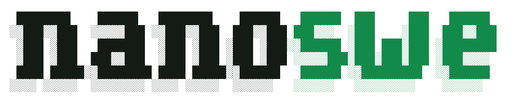

# nanoswe

<picture>
  <source media="(prefers-color-scheme: dark)" srcset="assets/nanoswe-dark.png">
  
</picture>

A community speedrun of SWE-bench Verified, built as a fork of
[karpathy/nanochat](https://github.com/karpathy/nanochat). This repo is the shared
codebase — training stack (`nanoswe/`, `scripts/`) plus the SWE-bench eval harness
(`eval/`). Records and writeups live at [nanoswe.com](https://www.nanoswe.com).

## Rules

1. **Stick to the train budget.** Training must finish within **12** ($60 track) or
   **192** ($1,000 track) **B200-hours**, timed on a single HGX B200 node (8× B200 SXM,
   180 GB HBM3e). The timer starts after the first training step, and no training step
   may be taken once the budget is exhausted — `--max-gpu-hours` enforces exactly this
   (see [logging & budget](#speedrun-logging--the-gpu-hour-budget)).
2. **Do not train on SWE-bench.** Training data may not be derived from SWE-bench's 12
   source repositories¹ or their forks and mirrors: their source code, git history,
   issues, pull requests, or agent trajectories generated from them. All else is fair
   game: architecture, optimizer, data, scaffolding, inference-time strategy, and so on.

¹ astropy, django, matplotlib, seaborn, flask, requests, xarray, pylint, pytest,
scikit-learn, sphinx, sympy.

## Submitting

Each track's record lives on its own branch — `main` hosts the 192 B200-hour speedrun, a
separate branch the 12 B200-hour one — as `record.sh` (the run's launch script) plus the
run's log file. Submit a **pull request** against the track's branch with your
training-stack changes and:

1. the run's **log file** (`speedrun.log`) — lets us verify the run was produced with the
   PR's training-stack commit, its training time, and the hash of the model weights;
2. a link to the **training data**, if changed (it must be publicly available);
3. a link to the **final model weights**;
4. the **SWE-bench Verified eval trajectory files** — 5 independent samples per problem
   (`eval/run_eval.sh <export> <out> verified 5 48`, see `eval/README.md`).

Once we verify the run improves on the current record, the PR is merged and the
[records](https://www.nanoswe.com) are updated. **Lacking compute?** Contributions are
still welcome: training speed improvements that do not affect numerics buy more training
within the same budget; promising $60-scale submissions will be scaled up to $1,000; and
if the training data is unchanged and your run improves held-out perplexity on teacher
trajectories, we can run the pass@1 evals for you.

## Prerequisites

1. **Environment:** clone the repo and `uv sync` to provision the dependency env
   (`pyproject.toml`; not an installable package — you run from the repo root). Needs an
   H100/B200-class GPU for `--fp8` + FlashAttention-3/4.
2. **Tokenizer:** a nanoswe RustBPE tokenizer (vocab 32,768, web-text-trained) at
   `$NANOSWE_BASE_DIR/tokenizer/tokenizer.pkl`. Train it with nanoswe's standard
   `scripts/tok_train.py` (a SWE-fit tokenizer was tested and is **null** on pass@1 — keep
   the web tokenizer). `NANOSWE_BASE_DIR` is where the tokenizer and checkpoints live.

## Run

```bash
export NANOSWE_BASE_DIR=/path/to/base               # tokenizer/ + base_checkpoints/
export NANOSWE_TRAJS_DIR=/path/to/nanoswe-trajs-v0  # optional; else auto-downloaded from the Hub

# the current record recipe of this branch (single launch, 8x B200):
./record.sh
```

`record.sh` is a thin wrapper over the trainer: it pins the recipe (depth, batch
geometry, `--phases` schedule + data mixture, loss norm, RoPE theta) and the
competition budget (`--max-gpu-hours`), then calls
`torchrun -m scripts.base_train`. Multi-phase runs (curriculum + crossfade
transitions) run in ONE process over one continuous global step — see
`nanoswe/phases.py` and the mechanistic validators
(`python -m scripts.validate_phases`, `python -m scripts.validate_mixture`).

### Speedrun logging & the GPU-hour budget

Every run writes a timestamped log to `base_checkpoints/<tag>/speedrun.log` (rank 0):
a one-time **system snapshot** (GPUs, CUDA, RAM, CPU cores), one line per step
(clock time, step, loss), each checkpoint's save time, and the stop event.

`--max-gpu-hours <H>` caps the run at a **GPU-hour budget** (the speedrun unit): on
`NPROC` GPUs that is a wall-clock cutoff of `H / NPROC` hours (e.g. 12 GPU-h on 8 GPUs
= 90 min). The clock starts **after the first step** (so `torch.compile` / kernel autotune
/ warmup don't count) and is checked every step (DDP-synchronized, so all ranks stop on
the same step); when it's spent the loop writes one final checkpoint and exits. The
record scripts pin the competition budget (12 or 192). See `nanoswe/speedrun_log.py`.

**Output layout + vLLM export.** Each run's tag directory holds the raw checkpoint in
`pt/` and a vLLM-loadable export in `vllm/`:

```
base_checkpoints/<tag>/
  speedrun.log                              # system info, per-step loss, stop event, export hash
  pt/    model_<step>.pt   meta_<step>.json
  vllm/  model.safetensors  config.json  tokenizer*  model.safetensors.sha256
```

After `torchrun` exits, the speedrun scripts package `pt/` into `vllm/` (via
`scripts/export_vllm.sh`, **default ON**) and append the `model.safetensors` **sha256** to
`speedrun.log` — the eval harness serves `vllm/`, so that hash pins exactly which weights
were evaluated. The export runs in a separate vLLM+transformers env (`VLLM_VENV`, default
`/lustre/home/rolmedo/vllm0201`) because the training env is lean; it stages to `/tmp` then
`dd`s onto Lustre. It's best-effort — a failed export never touches the saved `pt/`
checkpoint — and `NANOSWE_VLLM_EXPORT=0` skips it.

## Citation

```bibtex
@misc{nanoswe2026,
  title        = {nanoswe: speedrunning SWE-bench},
  author       = {Ricardo Olmedo and Moritz Hardt and Bernhard Sch{\"o}lkopf and Sanmi Koyejo},
  year         = {2026},
  howpublished = {\url{https://github.com/nanosweb/nanoswe}},
}
```
